# 技术路线skill

从任务书、PPT、论文或研究方案中提炼逻辑，绘制紧凑的学位论文式、国自然等科研申请式技术路线图，并交付可拆分、可编辑的 SVG。

标准技能名称为 `technical-roadmap`，界面显示名称为 **技术路线skill**。核心工作流：源内容核对 → 短节点与分支设计 → 紧凑排版 → 原生 SVG → 渲染和拆分检查。

## 面上基金技术路线图

参考公众号公开模板和知乎申请绘图说明，实际查看了大学官网转载的BioSoph图样，再将两项已核实面上项目的公开研究内容绘成下面两种格式。原图未直接复制；公众号模板、教学经验与获资助项目分别注明，知乎例图尚未完成图面核验。详情见[公众号、知乎参考及新绘范围](technical-roadmap/references/mianshang-layouts.md)。

### 目标递进式：陶瓷轴承

面上项目52275119：共同输入→温变/乏油两项并行机制→双端支承耦合→振声状态映射。三段用浅绿、浅蓝和暖色区分，模型与实测之间的校正用虚线表示。

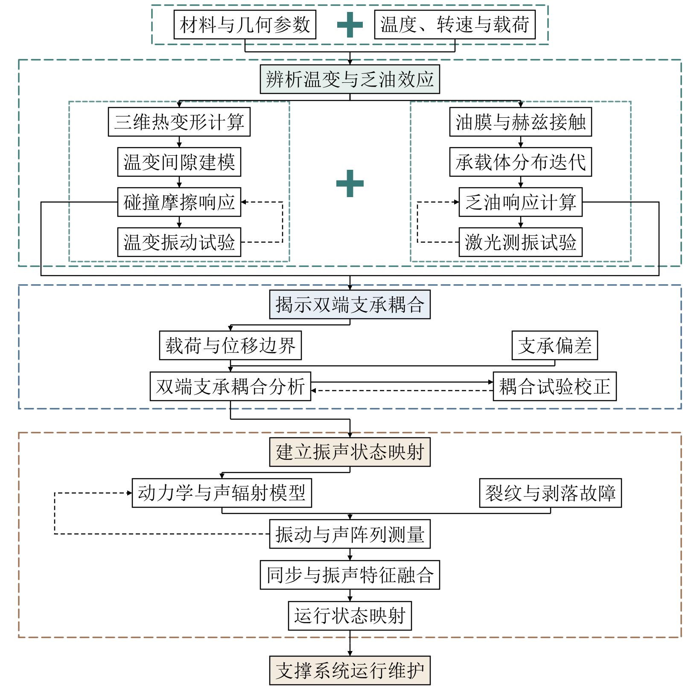

[可编辑SVG](technical-roadmap/assets/examples/mianshang-bearing-goal.svg) · [项目及公开正文证据](technical-roadmap/references/funded-cases.md)

### 任务与指标矩阵式：心肌钙敏感受体

面上项目30370577：器官、细胞、分子三列并行，对象准备、干预/检测与观察指标逐行对齐，最后汇入研究目标。三种浅色分组、黑框黑箭头和宽加号，保留各层次专属内容。

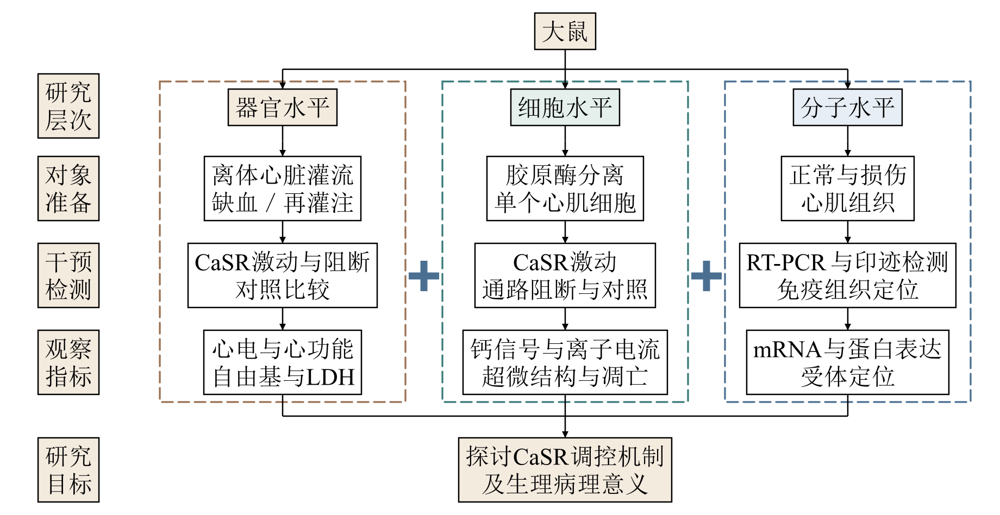

[可编辑SVG](technical-roadmap/assets/examples/mianshang-casr-matrix.svg) · [项目及公开正文证据](technical-roadmap/references/funded-cases.md)

两图均为原生可编辑SVG，统一字号，中文宋体、英文和数字Times New Roman，每框一个完整文字对象。已有优秀青年案例保持其实际类别。

## 绘图结果展示

下面展示配色、已资助来源的重绘案例和原创版式示例，每张路线图附有可编辑SVG。点击图片可查看完整尺寸。来源性质分别说明，示例不能替代新任务的原始研究内容。

### 已资助来源：陶瓷轴承，52275119

白晓天《面向宽温域乏油条件的陶瓷轴承转子系统动态特性研究》，2022年面上申请。根据公开副本正文20—32页概括重绘，保留“温变间隙＋乏油承载→结构耦合→振声融合→状态映射”及实验校正关系。公开副本来自第三方镜像，获资助题名、主持人与批准号由大学官方页交叉核实；未取得原图8像素，不称原图复刻。

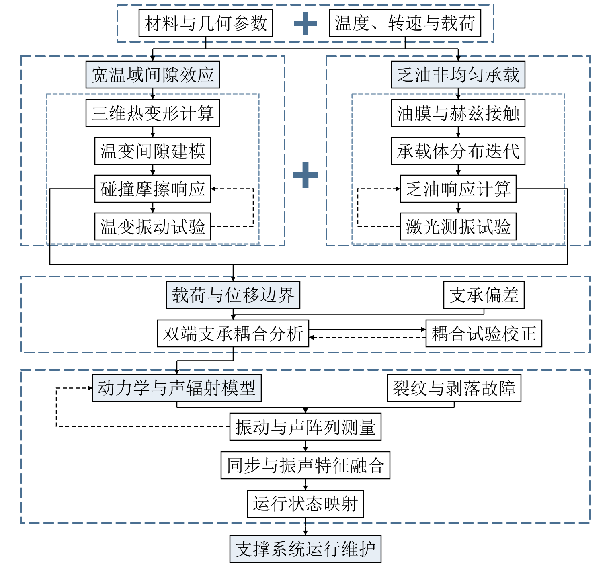

[可编辑SVG](technical-roadmap/assets/examples/funded-bearing-52275119.svg) · [申请正文公开副本](https://pdfcoffee.com/document6a553ef335fef-pdf-free.html) · [主持人官方页](https://jixie.sjzu.edu.cn/info/1021/3102.htm) · [批准号官方记录](https://jixie.sjzu.edu.cn/info/1021/3117.htm)

### 已资助来源：心肌钙敏感受体，30370577

徐长庆《大鼠心肌细胞钙敏感受体的生物学活性及其在心肌缺血/再灌注损伤中的作用》，2003年面上申请。根据公开正文的研究方法、技术路线与实验方案概括重绘，保留器官、细胞、分子三层次并行和各支专属干预、观察指标。作者署名的成功标书分享与中科院原站资助名单相互核对；未取得完整文件下载或原路线图像素。

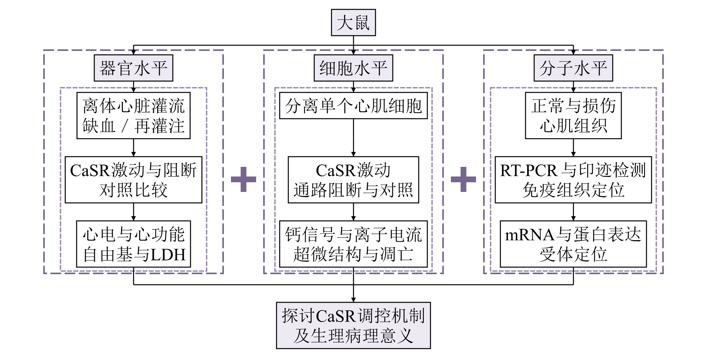

[可编辑SVG](technical-roadmap/assets/examples/funded-myocardial-casr-30370577.svg) · [申请正文公开预览](https://www.renrendoc.com/paper/95272669.html) · [本人成功标书分享](https://paper.dxy.cn/article/18373) · [2003年度资助名单](https://lifescience.sinh.ac.cn/webadmin/upload/20036321.pdf)

### 已资助项目框架片段：二维材料，61422503

倪振华《二维层状材料的光学与光电性能》，2014年优秀青年科学基金项目。根据其大学官网公开申请经验课件第9页重绘研究框架，保留“光学性质→性能调控与光电器件”及双向关系。课件第5页列出批准号，学院公告确认同题获资助；这份来源是框架片段，不是完整申请书。

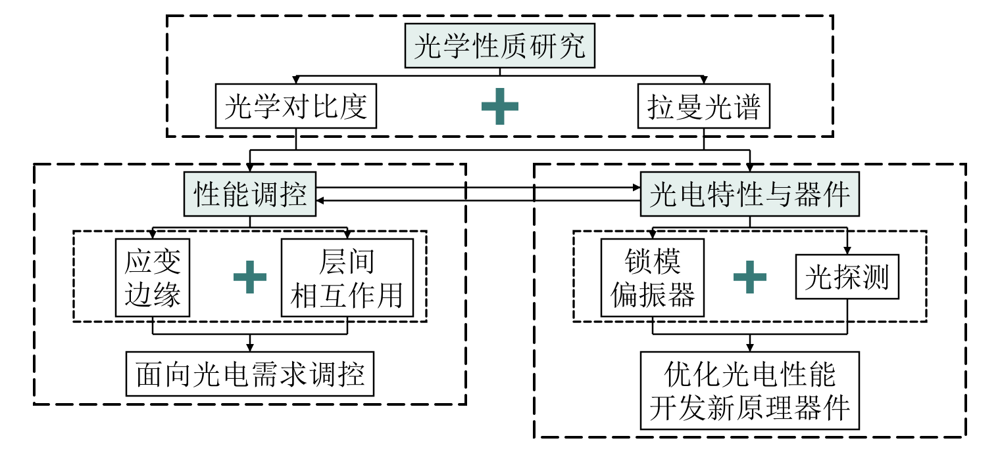

[可编辑SVG](technical-roadmap/assets/examples/funded-layered-material-61422503.svg) · [负责人公开课件](https://kjc.seu.edu.cn/_upload/article/bf/05/6659235148ac968c3664fc59d068/fc21d78d-1029-4a40-b353-13dc55afcf40.pdf) · [大学获批公告](https://physics.seu.edu.cn/2014/0818/c23142a258609/pagem.htm)

案例证据、原页码和重绘范围见 [已资助案例来源](technical-roadmap/references/funded-cases.md)。仅分享概括重绘的SVG与预览，不转载申请书全文、个人资料或第三方论文图件。

### 六种配色

论文参考色、黑白、蓝色、青绿、紫色、暖色，并支持六个角色的自定义颜色。文字与连线对比度会被检查，配色不会改变字体、字号或研究逻辑。

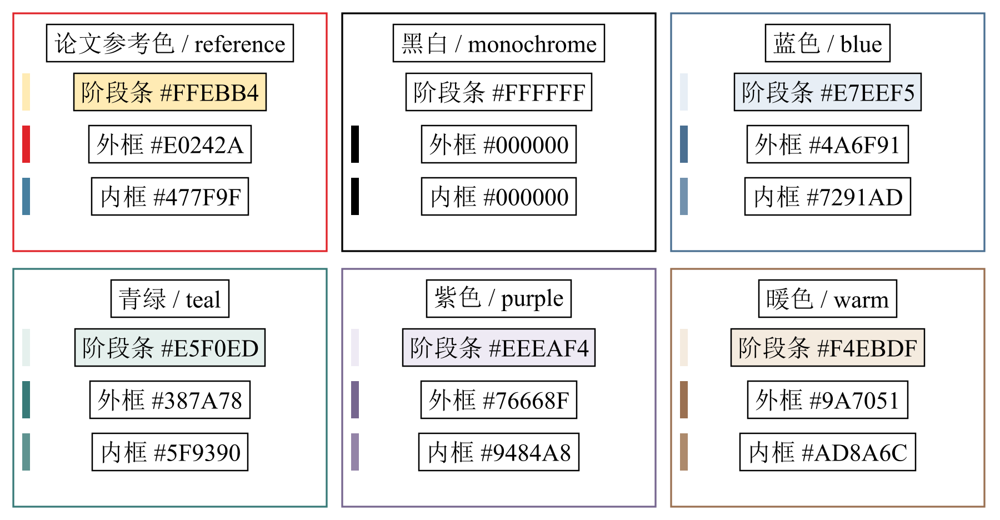

### 科研申请图式：材料科学，蓝色三分支

科学问题与待检验假设 → 表征、追踪和建模三条任务 → 机制关联 → 独立验证 → 预期认识。

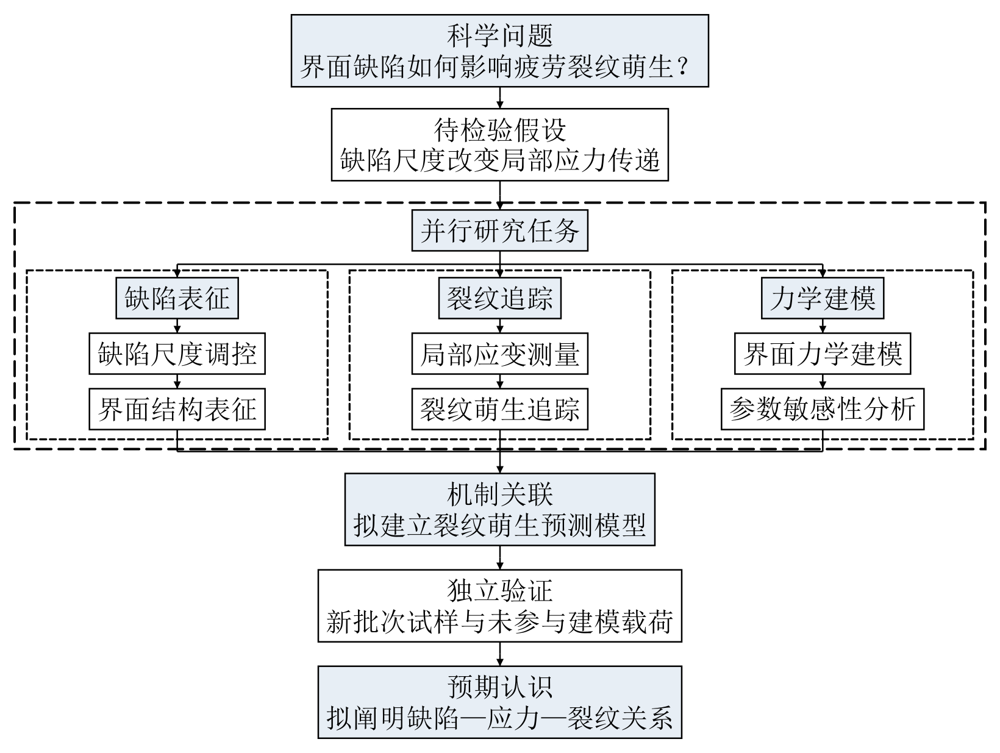

[查看可编辑SVG](technical-roadmap/assets/examples/nsfc-material-blue.svg)

### 科研申请图式：环境科学，青绿双链

现场观测与控制试验分别推进，再整合证据，并用新场地、新周期的样本验证。

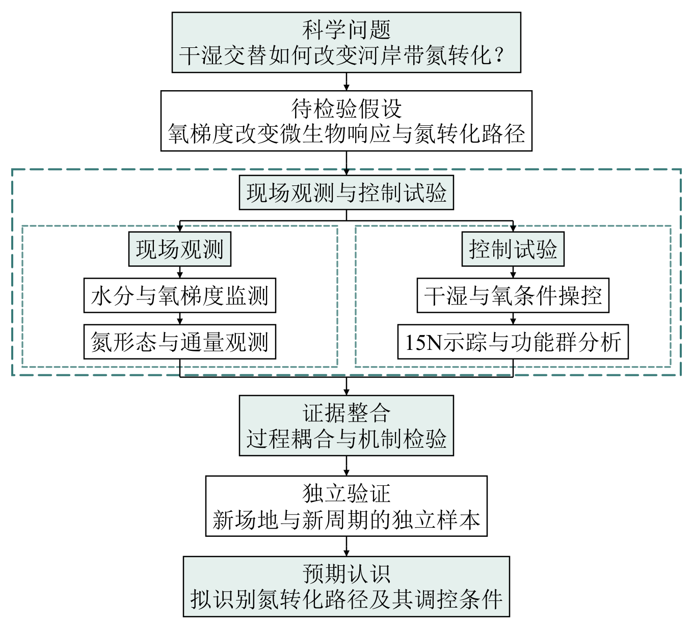

[查看可编辑SVG](technical-roadmap/assets/examples/nsfc-environment-teal.svg)

### 科研申请图式：医学，紫色分支变化

三项研究任务 → 证据汇聚 → 机制检验与独立供者验证两条支线 → 预期认识，保留真实的分支变化。

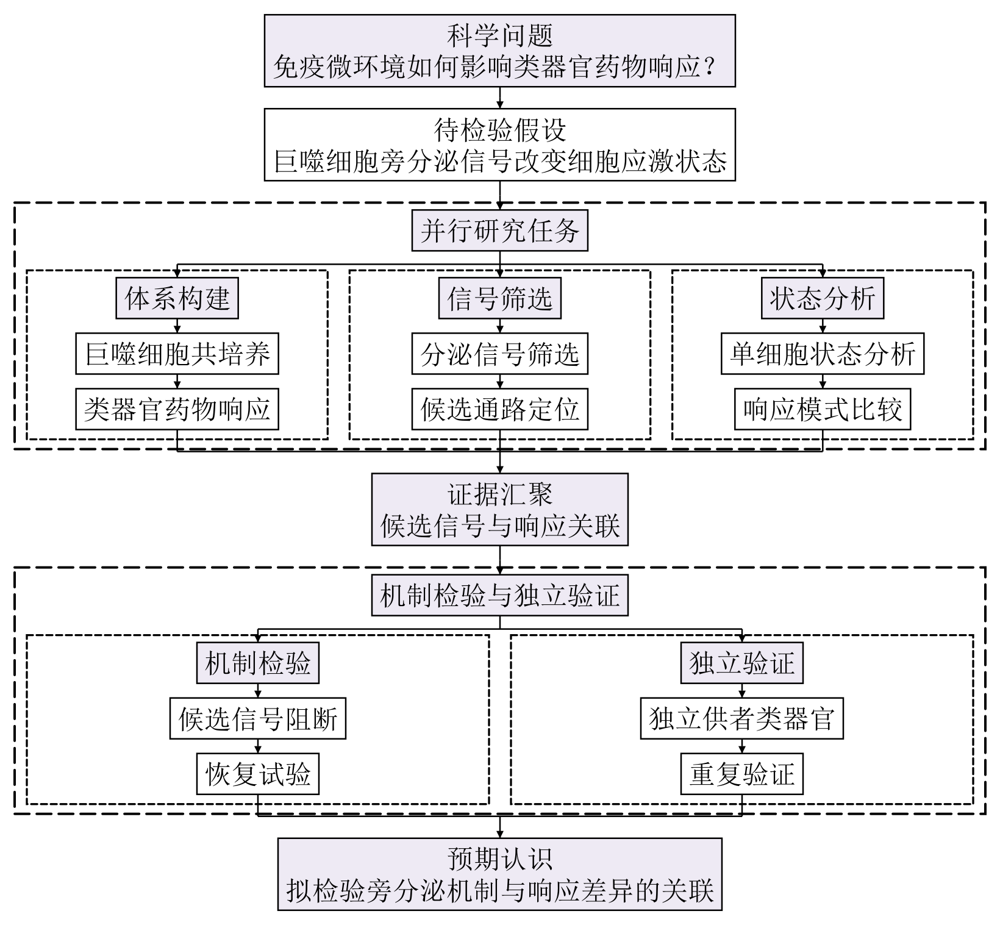

[查看可编辑SVG](technical-roadmap/assets/examples/nsfc-medicine-purple.svg)

上面材料、环境和医学三张图式为原创假设研究方案，不代表真实获资助项目或已证实结论。它们以原生SVG直接编排，展示分支数量变化；自动工具适用于固定分支数量。

布局参考来自实际查看的机构公开资料：西安交大一附院汇编第2、4、6页，以及成都理工公开绘图课件第26、27页。参考方法、公开链接和资料性质见 [国自然布局参考](technical-roadmap/references/nsfc-layouts.md)；这些图式不构成基金委统一绘图规范，仓库不转载原图。

### 材料性能技术路线

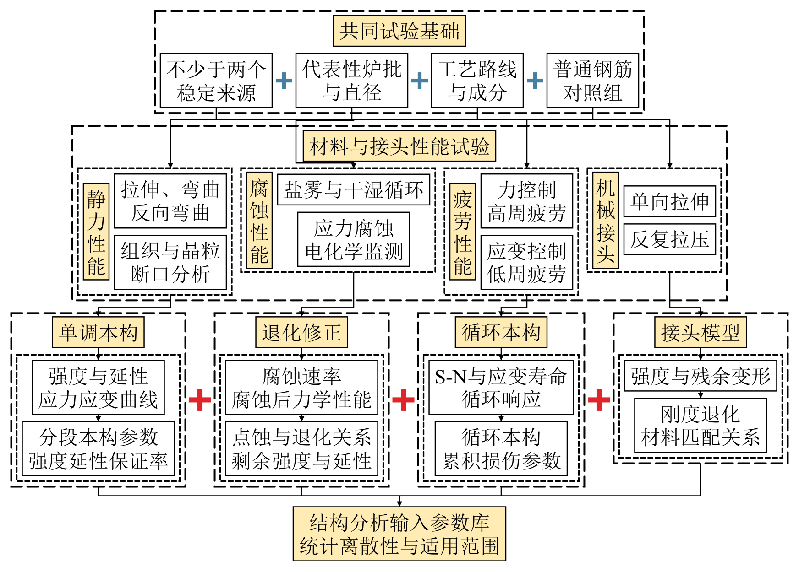

[查看可编辑SVG](technical-roadmap/assets/examples/material-properties.svg)

### 构件设计技术路线

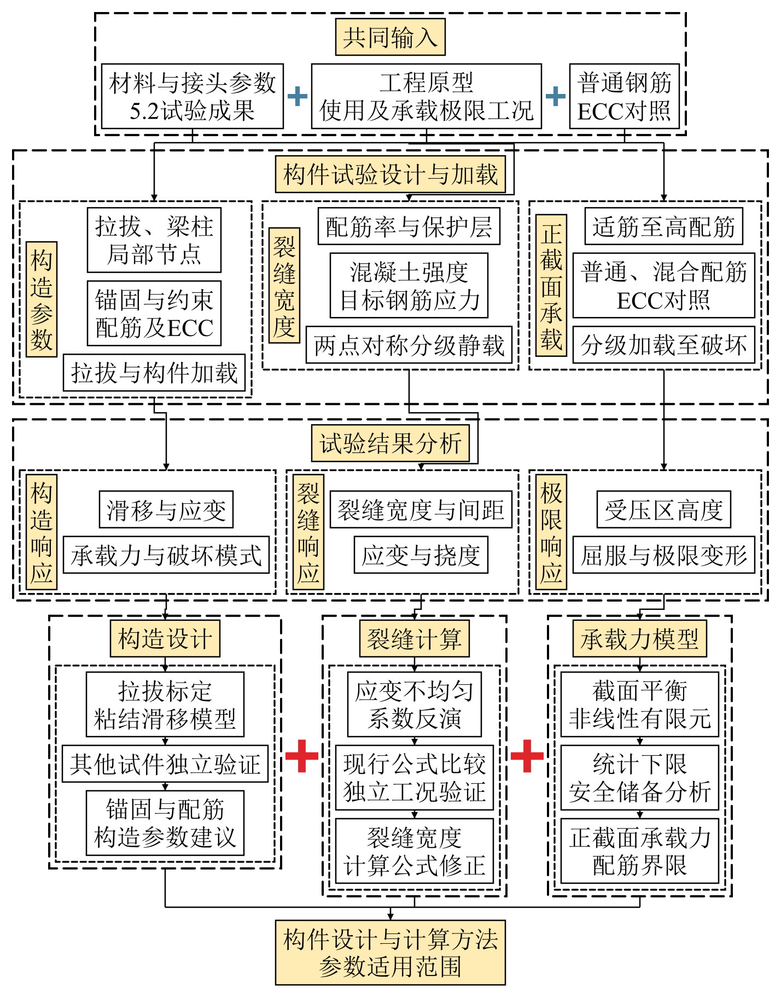

[查看可编辑SVG](technical-roadmap/assets/examples/component-design.svg)

### 结构性能技术路线

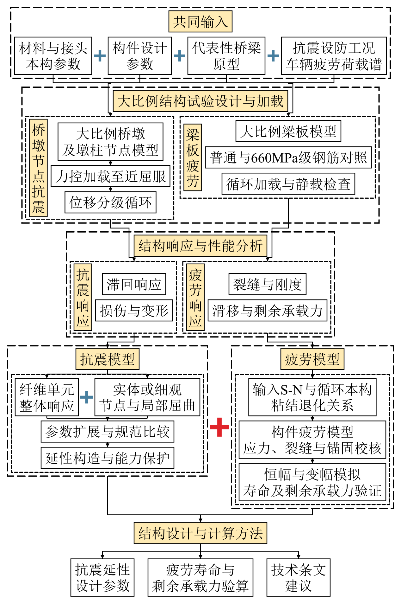

[查看可编辑SVG](technical-roadmap/assets/examples/structural-performance.svg)

已有示例已核对文字和分支，并通过同一渲染器的取消分组差分检查。新产物仍需逐图检查。跨软件导入可能受字体及SVG支持差异影响，尤其Office“转换为形状”与SVG取消分组不是同一操作。

## 安装与调用

将本仓库的 `technical-roadmap/` 目录复制到 `~/.codex/skills/`。在 Codex 中使用：

> 请使用 $technical-roadmap，根据这份任务书绘制技术路线图，中文宋体、英文和数字 Times New Roman，统一字号，输出可编辑 SVG，并检查取消分组后的文字和形状。

也可以直接提出科研申请绘图需求：

> 请使用 $technical-roadmap，将这份研究方案绘成国自然申请书风格的技术路线图，采用青绿配色，突出科学问题、并行研究任务与验证关系，输出PNG预览和可编辑SVG。

用户指定的内容、颜色、字体和布局优先。自动发现默认启用；原生SVG导出工具无需GitHub凭据或API密钥。

## 文件结构

```text
technical-roadmap/
  SKILL.md
  agents/openai.yaml
  scripts/render_roadmap.py
  scripts/check_svg.py
  references/input-schema.md
  references/nsfc-layouts.md
  references/funded-cases.md
  references/mianshang-layouts.md
  references/validation.md
  assets/example_roadmaps.json
  assets/examples/
```

## 绘图工具

Python 3 和 Pillow 用于字体尺寸测量。先使用现有环境；缺少 Pillow 时可在项目虚拟环境安装 `pip install Pillow`。不安装或分发字体；Windows 可使用系统已有字体，其他系统需要提供合法的字体文件路径。

```sh
python technical-roadmap/scripts/render_roadmap.py technical-roadmap/assets/example_roadmaps.json --output output
python technical-roadmap/scripts/check_svg.py output --report checks.json --ungrouped-dir ungrouped
```

其他系统通过 `--chinese-font` 和 `--latin-font` 指定宋体与 Times New Roman 字体文件。输入结构见 [input-schema.md](technical-roadmap/references/input-schema.md)，渲染与拆分检查见 [validation.md](technical-roadmap/references/validation.md)。

JSON中设置 `style.layout: "proposal"` 可采用横向分支标签，设置 `style.color_scheme` 选择配色；`style.colors` 支持六角色的十六进制颜色覆盖。布局选择不改变分支对应关系。交叉边、反馈或分支数量变化应直接编排原生SVG。

每个文字框保存为一个矩形加一个完整文字对象，多行及中英混排使用 `tspan`。边框、箭头和粗加号为独立矢量对象。字体、颜色、字号和位置显式记录在对象上，取消分组后不依赖父分组样式。

仓库不包含原始任务书、第三方论文PDF、商业字体、账号凭据或电脑上的绝对路径。
